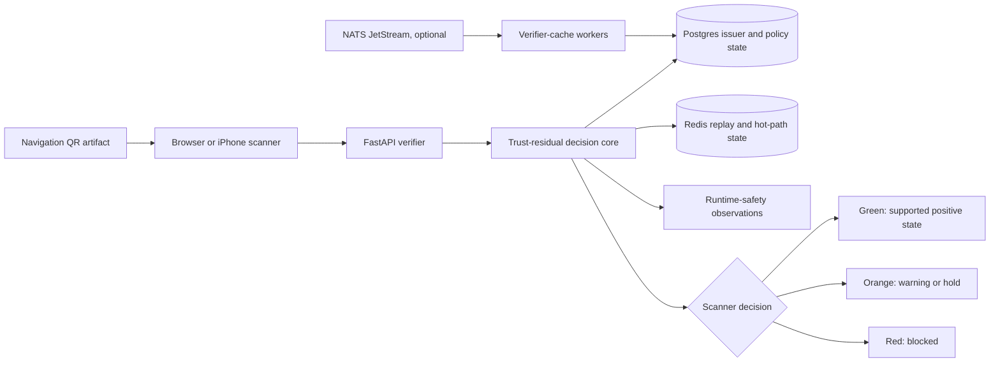

# QR Trust PoC

Reference software for evaluating navigation QR codes against issuer,
destination, and runtime-safety state before a scanner presents a user-facing
decision.

Most QR scanners answer one question: _what data is encoded?_ This project
tests a stricter question: _what decision can a scanner justify from the
evidence currently available?_ The PoC combines signed-payload verification,
issuer-state checks, destination binding, replay control, runtime observations,
and explicit green/orange/red scanner states.

> [!IMPORTANT]
> This repository is a research and engineering PoC. It is not a deployed
> trust root, certification authority, malware scanner, production identity
> system, or proposed universal QR standard. Its fixtures and evaluation corpus
> are controlled conformance artifacts, not evidence of field effectiveness.

> [!NOTE]
> Destination policy authorizes normalized URL components only: scheme, host,
> port, path, and permitted query keys. A match does not prove that the DNS
> answer, hosting account, response content, or post-open navigation is
> unchanged or safe. Those require separate, current evidence; the PoC does
> not convert a URL-policy match into content or infrastructure integrity.

## Published research

The conceptual foundation is two published SSRN working papers. The first
argues why navigation QR security is a trust-model problem; the second defines
the decision semantics this PoC implements.

> Hassan El-Masri, “QR Navigation Security Is Not Primarily a Cryptography
> Problem: A Trust-Model Framework for Managed Issuer Verification,
> Destination Binding, and Runtime Safety” (April 12, 2026), SSRN Abstract
> 6577478. [Paper](https://papers.ssrn.com/sol3/papers.cfm?abstract_id=6577478) ·
> [DOI](https://doi.org/10.2139/ssrn.6577478)

> Hassan El-Masri, “Trust Residuals for Navigation QR Codes: Decision Semantics
> for Issuer, Destination, and Runtime Safety State” (August 3, 2026), SSRN
> Abstract
> 7225699. [Paper](https://papers.ssrn.com/sol3/papers.cfm?abstract_id=7225699)

If you use, evaluate, or extend this PoC in academic or technical work, please
cite the papers — [Citing this work](docs/public/CITING.md) says which covers
what and carries copy-ready formats, and machine-readable metadata is in
[CITATION.cff](CITATION.cff).

## Internet-Draft

The IETF individual submission
[Trust Residuals for Navigation QR Codes](https://datatracker.ietf.org/doc/draft-elmasri-qr-trust-residuals/)
defines the architecture and candidate decision semantics implemented by this
PoC. The repository carries the exact submitted
[Markdown source](ietf/draft-elmasri-qr-trust-residuals-00.md) and
[RFCXML v3](ietf/draft-elmasri-qr-trust-residuals-00.xml).

## What the PoC demonstrates

The implementation separates trust questions that are often collapsed into a
single “valid QR” result:

1. **Artifact integrity** — can the QR be decoded consistently, without an
   ambiguous or conflicting artifact?
2. **Cryptographic integrity** — is the canonical payload correctly signed?
3. **Issuer and policy state** — is the issuer recognized, active, sufficiently
   assured, and authorized for the destination?
4. **Runtime state** — is required destination-safety evidence current and
   acceptable?
5. **Decision semantics** — should the scanner open, warn, hold, or block?

See the [trust layers](docs/public/TRUST_LAYERS.md),
[verifier profile](docs/public/VERIFIER_PROFILE.md), and
[scanner decision matrix](docs/public/SCANNER_DECISION_MATRIX.md) for the
normative PoC behavior.

## System overview



The default Compose profile runs the API, React workbench, Postgres, and Redis.
NATS, the second verifier, management CLI, and network workers are optional
profiles for propagation and federation experiments. The
[project overview](docs/public/PROJECT_OVERVIEW.md) explains each component and
the end-to-end data flow.

## Components

| Component | Location | Purpose |
| --- | --- | --- |
| Decision and verifier services | [`backend/`](backend/) | FastAPI endpoints, signature and policy checks, replay protection, artifact analysis, management APIs, and tests |
| Research workbench | [`frontend/`](frontend/) | React interface for learning, QR generation, scan/upload experiments, and operator-visible state |
| Native scanner | [`ios/VerifierLabApp/`](ios/VerifierLabApp/) | SwiftUI iPhone scanner for real-device decision and evidence testing |
| Reference network | [`network/`](network/) | Effect TypeScript contracts and workers for publication, propagation, cache materialization, and runtime observations |
| Technical documentation | [`docs/`](docs/) | Architecture, decision semantics, run guides, evaluation artifacts, evidence manifests, and network contracts |
| Local orchestration | [`compose.yml`](compose.yml) and [`Makefile`](Makefile) | Reproducible development profiles, smoke checks, and documentation commands |

## Quick start

### Prerequisites

- Docker with Compose support for the default end-to-end path
- Python 3.12+ and [`uv`](https://docs.astral.sh/uv/) for local backend and
  documentation work
- Node.js 22+ for local frontend and network-package work
- Xcode only for the native iOS target

### Run the default stack

```bash
make up-admin
make smoke-compose
```

Open:

- React verifier workbench: <http://127.0.0.1:5173/>
- FastAPI landing page: <http://127.0.0.1:8000/>
- OpenAPI documentation: <http://127.0.0.1:8000/docs>

Stop the stack with:

```bash
make down
```

The `up-admin` target enables a documented local-only bootstrap credential for
the lab. Do not reuse local defaults in an exposed or production environment.
For alternate ports, HTTPS, LAN testing, shared infrastructure, or native iOS
setup, follow the [run guide](docs/public/RUN_GUIDE.md).

### Run the core checks

```bash
make test-backend
make lint-frontend
make build-frontend
make check-trust-residuals-evaluation
make release-audit
```

The evaluation is deterministic and offline. Its 37-case corpus tests decision
semantics and weaker baselines; it does not measure real-world detection rates
or user comprehension. See the
[evaluation guide](docs/public/evaluation/README.md).

### Read the documentation locally

```bash
make docs-build
make docs-serve
```

Then open <http://127.0.0.1:8088/>. The server exposes the filtered static
build, not the private maintainer-only document tree. Override the bind address
or port only when needed:

```bash
make docs-serve DOCS_HOST=127.0.0.1 DOCS_PORT=8090
```

Architecture and decision diagrams support a click-to-open inspection view
with zoom, pan, fit, actual-size, and keyboard controls.

## Practical hardware estimates

These are planning estimates for local experimentation, not benchmark results
or enforced limits. Actual use depends on container runtime, image cache,
browser tooling, and whether optional network or iOS profiles are enabled.

| Workload | CPU | Memory | Free disk | Notes |
| --- | ---: | ---: | ---: | --- |
| Read docs, run deterministic evaluation | 2 cores | 4 GB | 5 GB | No containers or accelerator required |
| Default Compose stack | 4 cores | 8 GB | 15 GB | API, frontend, Postgres, and Redis |
| Full network and browser-test workflow | 6–8 cores | 16 GB | 25 GB | Adds NATS, workers, browser binaries, and build caches |
| iOS simulator and full stack | Apple silicon recommended | 16 GB | 35 GB | Includes Xcode, simulator runtimes, containers, and Node/Python caches |

No GPU is required. For a constrained machine, run the deterministic backend
evaluation first and enable Compose profiles only when their behavior is under
test. More detail is in the
[service and hardware guide](docs/public/PROJECT_OVERVIEW.md#services-and-local-resource-estimates).

## Documentation map

| Reader | Start here |
| --- | --- |
| Professor or researcher | [Published paper and citation](docs/public/CITING.md), [project overview](docs/public/PROJECT_OVERVIEW.md), [evaluation scope](docs/public/evaluation/README.md) |
| Security or protocol engineer | [Trust layers](docs/public/TRUST_LAYERS.md), [security requirements](docs/public/QR_TRUST_SECURITY_REQUIREMENTS.md), [decision matrix](docs/public/SCANNER_DECISION_MATRIX.md) |
| Application developer | [Run guide](docs/public/RUN_GUIDE.md), [verifier profile](docs/public/VERIFIER_PROFILE.md), [test vectors](docs/public/TEST_VECTORS.md) |
| Platform or infrastructure engineer | [Network architecture](docs/public/NETWORK_ARCHITECTURE_PLAN.md), [network contracts](docs/public/network-contracts/README.md), [deployment evidence](docs/public/evidence/README.md) |

The complete curated index is [docs/README.md](docs/README.md).

## Security and disclosure

- Local services bind to loopback by default.
- Demo keys and credentials are fixtures for deterministic testing, not
  production secrets.
- The public-release audit checks the repository boundary, credentials,
  personal strings, binary manifests, links, and required validation hooks.
- Report suspected vulnerabilities privately as described in
  [SECURITY.md](SECURITY.md).

## Community

Questions, ideas, and feedback are welcome in
[GitHub Discussions](https://github.com/unixtime/qr-trust-poc/discussions).

## License

Licensed under [Apache-2.0](LICENSE). See [NOTICE](NOTICE) for attribution
information.
