# Deployment Rollout Graph

Date: 2026-04-12

Purpose:
- relate deployment candidates, incentives, stakeholder roles, and go-to-market direction
- show why broad public consumer QR is not the first practical market

!!! note "Diagram color key"
    Blue identifies the problem and stakeholder inputs, violet identifies
    ownership questions, green identifies stronger rollout candidates, amber
    identifies a secondary path, and red identifies the weak open-consumer
    path. Select the diagram to open the interactive zoom-and-pan view.

## Rollout Graph

```mermaid
flowchart TD
    R[QR trust problem] --> S1[Who owns issuer trust?]
    R --> S2[Who owns runtime safety?]
    R --> S3[Who controls scanner UX?]

    S1 --> P[Payments and financial institutions]
    S1 --> G[Government and public services]
    S1 --> E[Enterprise and institutional operators]
    S1 --> M[Merchant platforms]
    S1 --> O[OS and browser vendors]

    S2 --> C[Cybersecurity and reputation vendors]
    S2 --> O
    S2 --> P
    S2 --> E

    S3 --> O
    S3 --> P
    S3 --> E
    S3 --> M

    P --> D1[High fraud cost]
    G --> D2[High public trust need]
    E --> D3[Managed enrollment already exists]
    M --> D4[Stable destinations and merchant dashboards]
    O --> D5[Default scanner behavior]

    C --> D6[Runtime safety input layer]

    D1 --> F[Best first deployment slices]
    D2 --> F
    D3 --> F
    D4 --> F

    F --> F1[Payments]
    F --> F2[Merchant ecosystems]
    F --> F3[Enterprise and institutional QR]
    F --> F4[Government/public services]

    E --> B[Enterprise and institutional QR flows]
    G --> B
    B --> B1[Secondary rollout slice]
    B1 --> B2[Known destinations and operator policy]
    B1 --> B3[Still platform-dependent for scanner UX]
    B1 --> B4[Stronger than open consumer QR]

    R --> W[Weak first market]
    W --> W1[Open consumer web QR for ordinary individuals]
    W1 --> W2[Low operator control]
    W1 --> W3[High privacy resistance]
    W1 --> W4[No clear paying operator]
    W1 --> W5[Scanner adoption depends on platforms]

    C -.-> X[Secondary stakeholder]
    P --> Y[Primary stakeholder]
    G --> Y
    E --> Y
    M --> Y
    O --> Y

    classDef problem fill:#eaf2ff,stroke:#1d4ed8,color:#172554,stroke-width:2px;
    classDef question fill:#f1edff,stroke:#7c3aed,color:#2e2153,stroke-width:1.5px;
    classDef stakeholder fill:#edf6ff,stroke:#0284c7,color:#12364a,stroke-width:1.5px;
    classDef signal fill:#e8f8f5,stroke:#0f766e,color:#123c38,stroke-width:1.5px;
    classDef primary fill:#e9f8ee,stroke:#15803d,color:#153d24,stroke-width:2px;
    classDef secondary fill:#fff6db,stroke:#d97706,color:#4a2b05,stroke-width:2px;
    classDef weak fill:#fff0f1,stroke:#dc2626,color:#4c1518,stroke-width:2px;
    classDef role fill:#f8fafc,stroke:#64748b,color:#1e293b,stroke-width:1.5px;

    class R problem;
    class S1,S2,S3 question;
    class P,G,E,M,O,C stakeholder;
    class D1,D2,D3,D4,D5,D6 signal;
    class F,F1,F2,F3,F4,Y primary;
    class B,B1,B2,B3,B4,X secondary;
    class W,W1,W2,W3,W4,W5 weak;
```

## Reading Notes

Main point:
- the parties with the strongest incentive are not the same as the parties with the strongest security expertise

Implication:
- cybersecurity vendors matter, but mostly as runtime-safety contributors
- primary operators are more likely to be:
  - payment ecosystems
  - financial institutions
  - government and public-service operators
  - enterprise and institutional operators
  - platform vendors controlling default scanner behavior
  - enterprise and institutional deployments are relevant because they already control some combination of issuer onboarding, destination policy, and organizational workflow
  - these deployments are still weaker than payment or government ecosystems when scanner UX remains platform-dependent

## Strategic Summary

Best first path:
1. merchant or payment ecosystems
2. enterprise and institutional QR
3. government and public-service trust deployments

Weakest first path:
1. broad public consumer QR for unenrolled individuals

Secondary rollout path:
1. enterprise and institutional QR deployments outside tightly controlled payment or public-service ecosystems
2. more governable than open consumer QR, but still dependent on platform scanner behavior
