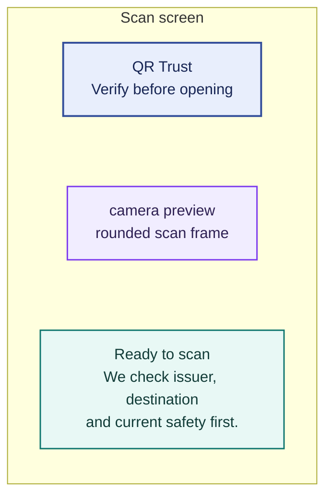
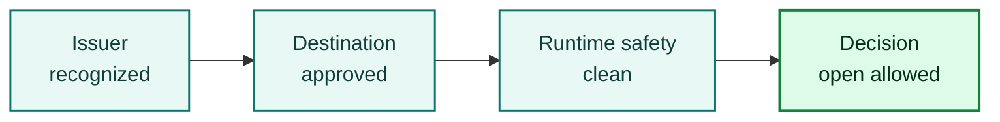
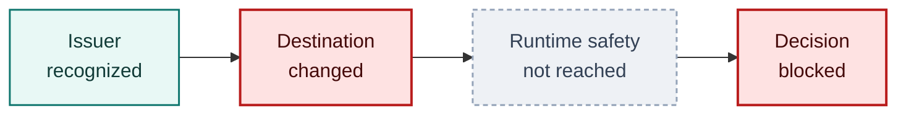

# iOS End-User Scanner App Design

Date: 2026-05-14

Purpose:
- design a production-oriented iPhone scanner experience, separate from the
  current native verifier test harness
- define how the iPhone app and laptop Web UI work together in the public PoC
- identify the backend contract needed before this becomes a real end-user
  scanner rather than a lab client

## 1. Product Framing

Working product name:
- `QR Trust`

Core user promise:
- scan first
- verify before opening
- explain the result in plain language

The iPhone app should not feel like a developer harness. It should feel like a
scanner that protects the user from confusing QR outcomes:

- known issuer and approved destination
- known issuer but changed destination
- signed but unknown issuer
- unverified QR
- active block condition

The laptop Web UI remains the companion surface for:

- issuing or displaying demo QR codes
- managing example issuer state and destination policy
- teaching, research review, and evidence capture
- operator/researcher inspection

The phone is the scanner. The laptop is the issuer/operator/demo console.

## 2. Important Architecture Shift

The current iOS harness is not yet an end-user scanner.

Current harness behavior:
- the phone generates a demo session
- the phone receives the certificate and issuer state
- scanned QR payloads are verified against that active demo session

That is correct for deterministic evidence capture, but it is not how an
ordinary scanner should work.

End-user scanner behavior:
- the phone scans a QR payload from the world
- the phone sends the raw QR payload to the verifier
- the verifier resolves issuer state, certificate state, destination binding,
  runtime safety, and freshness from its own trust cache
- the phone receives a user-facing decision state

Implemented backend contract:

```text
POST /scanner/decisions
```

Input:

```json
{
  "qr_payload": "...",
  "client": {
    "platform": "ios",
    "app_version": "0.1.0"
  }
}
```

Output:

```json
{
  "decision_state": "verified_issuer",
  "open_allowed": true,
  "primary_message": "Verified issuer and approved destination.",
  "issuer": {
    "name": "Acme Example",
    "tier": "business",
    "status": "active"
  },
  "destination": {
    "display_url": "https://acme.example/pay",
    "host": "acme.example",
    "binding": "approved"
  },
  "signals": [
    { "layer": "issuer", "state": "recognized" },
    { "layer": "destination", "state": "bound" },
    { "layer": "runtime", "state": "clean" }
  ],
  "actions": [
    { "id": "open", "label": "Open site", "style": "primary" },
    { "id": "details", "label": "Why this result?", "style": "secondary" }
  ]
}
```

The existing `/verifier/verify-scanned` stays for the deterministic lab harness.
The scanner-first iPhone flow targets `/scanner/decisions`, which accepts only
the captured QR payload and returns a user-facing decision state.

## 3. Audience

Primary:
- ordinary users scanning payment, menu, login, event, delivery, or service QR
  codes

Secondary:
- students and professors evaluating the trust model
- developers testing scanner and verifier behavior
- researchers comparing QR security outcomes

The same app can serve all three only if advanced details are progressively
disclosed. The first screen must be usable by a non-technical user.

## 4. App Navigation

Recommended tabs:

```text
Scan        History        Learn        Settings
```

Default launch:
- open directly to `Scan`
- camera is ready after permission is granted
- no dashboard before the scan

Advanced/developer content:
- hidden under result details and Settings
- never blocks normal scan/open flow

## 5. Core Screens

### 5.1 Scan Screen

Goal:
- make the user comfortable scanning without explaining the whole research
  model first

Layout:



The three regions stack in that order; the connectors are layout only and carry
no flow meaning.

Interactions:
- scan automatically when QR is centered
- freeze the frame after capture
- show `Checking...` for network verification
- transition into a decision sheet

Do not:
- immediately open the QR destination
- show raw JSON by default
- make the user choose a scenario before scanning

### 5.2 Decision Sheet

Goal:
- tell the user what to do next

The result should be a bottom sheet with one dominant state.

Accepted:

```text
Verified
Acme Example

Approved destination
https://acme.example/pay

[Open site]
[Why this result?]
```

Blocked:

```text
Blocked
Destination changed

This QR no longer points to the destination approved by the issuer.

[Do not open]
[View details]
```

Unverified:

```text
Unverified QR

No recognized trust signal was found.
This does not prove the QR is malicious.

[Continue with caution]
[View destination]
```

Signed unknown issuer:

```text
Signed, unknown issuer

The QR has a valid signature, but the issuer is not recognized by this trust
program.

[Continue with caution]
[Why this matters]
```

### 5.2.1 Rendered decision states

The frames below are design renders exported from the `Scanner UX States — iOS`
Figma board. They are not captures of a running build, and the reference
implementation does not yet emit every state shown here.

They serve both this section and §5.3: each frame is iPhone 393 x 852 and shows
the decision sheet with the trust strip already expanded, so one set of images
covers the sheet and its explanation.

The board follows [`SCANNER_UX_STATES.md`](SCANNER_UX_STATES.md), which
enumerates seven scanner decision states. The four sheets sketched above are
archetypes; these seven are the states those archetypes are drawn from.

Read colour and wording as two separate channels. Colour follows severity,
wording follows state. States 1, 2 and 5 all render amber and are unrelated to
each other — the headline, not the colour, is what distinguishes them.

**State 0 — unreadable capture** (`unreadable_capture`)

{ width="300" }

Decoding failed, so no trust layer ran. This is the one state with no trust
strip: there is no evaluation to explain.

**State 1 — unverified** (`unverified`)

{ width="300" }

An ordinary QR code with no trust signal attached. Absence of a signal is not
evidence of harm, and the copy must not imply otherwise.

**State 2 — signed, unaccepted issuer** (`signed_unknown_issuer`)

{ width="300" }

The signature verifies, but the issuer is outside the accepted set. The wire
label is `signed_unknown_issuer`, retained for compatibility after the state was
renamed — "unaccepted" is a policy decision, not a failure to recognise.

**State 3 — verified issuer** (`verified_issuer`)

{ width="300" }

All four layers pass. This is the only state that offers a plain primary action
with no friction.

**State 4 — destination changed** (no wire label assigned)

{ width="300" }

Specified but not yet emitted. `SCANNER_UX_STATES.md` assigns this state no wire
label and instructs implementers not to infer one, which is why this frame
carries no state chip while the others do.

Two things follow for implementation. Runtime safety reads `Not reached`, not
`clean` — binding failed before any risk check ran, and reporting an unrun check
as passing would overstate what is known. And the severity is red while the
semantics are a strong warning, not a hard block: the escape hatch is present,
deliberately behind a hold gesture.

**State 5 — verified issuer, destination risky** (`verified_issuer_destination_risky`)

{ width="300" }

Issuer trust and destination safety disagree. The issuer did nothing wrong, so
the copy blames the destination rather than the brand.

**State 6 — blocked** (`blocked`)

{ width="300" }

The only state with no escape hatch. Several distinct failures collapse here, so
the sheet says so rather than implying a single cause.

Coverage: the board covers this section and §5.3 only. §5.1 Scan Screen, §5.4
History, §5.5 Learn and §5.6 Settings have no Figma frames yet — the wireframes
and prose in those sections remain their only reference.

Sample identity: the ASCII blocks in §5.2 predate the board and still use
`Acme Example` / `acme.example/pay`, while the renders and
`SCANNER_UX_STATES.md` use `Example Brand, Inc.` / `example-brand.com`. Both are
illustrative, but the two should be reconciled the next time §5.2 is edited.

### 5.3 Explanation View

Goal:
- teach the model only after the user asks for detail

Use a compact trust strip that walks the layers in order:



For failures, highlight the first blocking layer and show the ones after it as
unevaluated rather than passing:



Runtime safety is drawn dashed because binding failed before that check ran.
Reporting an unrun check as `clean` would overstate what is known.

This maps directly to the paper without showing a dense academic diagram.

Rendered, this strip appears inline in every frame in §5.2.1 — the pass example
above is State 3, the failure example is State 4.

The failure chain ending in `blocked` is not a discrepancy: `blocked` is the
`decision_state` the backend actually emits for a destination mismatch, which it
distinguishes from other blocking failures with
`verifier_stage: "payload_revalidation"`. Severity is read from the decision
state and wording from the stage, so `blocked` selects the red treatment and
forces the hold gesture while the stage supplies the "Destination changed" copy.
The escape hatch survives — State 6 is the only state that withdraws it.

### 5.4 History

Goal:
- let the user revisit recent scans without storing unnecessary sensitive data

History item:
- decision state
- normalized destination host
- issuer name when available
- timestamp
- short reason

Privacy default:
- store history locally only
- do not store full QR payload unless developer mode is enabled
- allow one-tap deletion

### 5.5 Learn

Goal:
- explain QR trust in short lessons

Suggested lessons:
- `Why decoding is not trust`
- `What a verified issuer means`
- `Why a verified issuer can still be risky`
- `What destination binding checks`
- `What unverified means`

Each lesson should include one diagram and one example, not a long paper excerpt.

### 5.6 Settings

User settings:
- trusted verifier service URL
- privacy and history retention
- haptic/audio feedback
- open behavior after accepted scan
- report suspicious QR

Developer mode:
- show raw payload
- show request ID
- show verifier stage
- export debug bundle

Developer mode must be off by default.

## 6. Decision State Model

The user-facing app should not expose backend stage names as the primary label.
Backend stages remain useful in details.

Recommended user states:

| User state | Primary color | Primary action | Backend examples |
| --- | --- | --- | --- |
| Verified | Green | Open site | `accepted` |
| Verified, caution | Amber | Review before opening | runtime warning |
| Signed, unknown issuer | Amber | Continue with caution | unknown issuer |
| Unverified | Neutral | View destination | no trust signal |
| Blocked | Red | Do not open | `payload_revalidation`, expired (`freshness` block, cause `object-expired`), revoked, unsafe |

Important rule:
- never label an unsigned or unrecognized QR as malicious unless there is an
  active safety signal

## 7. Laptop Web UI Role

The laptop Web UI should become the companion console.

Primary surfaces:

1. Scenario builder
- choose issuer, destination policy, runtime state, validity window
- generate QR
- display QR full screen

2. Live scan monitor
- show when the phone scanned
- show the verifier decision
- show request ID and stage timeline

3. Teaching mode
- present the QR on the left
- present expected outcome and explanation on the right
- let students scan with the iPhone app

4. Operator mode
- inspect issuer records
- inspect destination policy
- inspect envelope scan-budget and rate-limit posture
- export evidence packet

The Web UI should not be required for ordinary scanning in the final product.
It is required for the PoC demo, evidence capture, and classroom/research use.

## 8. End-To-End Demo Flow

```text
Laptop Web UI
  create scenario
  display QR

iPhone App
  scan QR
  send raw QR payload to verifier

Verifier API
  resolve issuer and destination state
  return decision state

iPhone App
  show decision sheet

Laptop Web UI
  optionally show live result timeline
```

The important improvement over the current harness:
- the laptop owns scenario display
- the phone owns scanning
- the verifier owns trust resolution

## 9. Visual Direction

Style:
- calm security product
- closer to a banking/passkey verification app than a developer dashboard
- light-first, with a high-quality dark mode later

Color tokens:

```text
surface           #F7F3EA
surface-raised    #FFFFFF
ink               #171A17
muted             #6F746D
verified          #1F8A5B
caution           #B7791F
blocked           #B42318
trust-blue        #1D4E89
line              #E5DED2
```

Motion:
- camera capture freezes into a result sheet
- accepted sheet rises with a soft spring
- blocked sheet uses a shorter, firmer transition
- explanation rows reveal in sequence
- respect Reduce Motion

Typography:
- use native Dynamic Type and SF Pro
- use large, plain result labels
- use monospaced text only for payload hashes, request IDs, or developer details

## 10. Accessibility Requirements

Minimum:
- all buttons 44pt or larger
- no color-only result state
- VoiceOver reads result, issuer, destination, and recommended action
- haptics are supplemental, never the only signal
- Dynamic Type support without clipped result text
- visible cancel path from scanner and result sheet
- accepted/open action requires an explicit tap

## 11. Privacy And Safety Requirements

The app should make three commitments clear:

1. It checks before opening.
2. It does not automatically open QR destinations.
3. It stores scan history locally unless the user exports or reports it.

For public PoC:
- do not send analytics
- do not embed third-party tracking SDKs
- keep debug export explicit
- avoid storing complete QR payloads in history by default

## 12. First Build Milestones

### Milestone A: Product Shell

Goal:
- replace the harness-first native UI with a scanner-first product shell

Tasks:
- add `Scan`, `History`, `Learn`, `Settings` tabs
- move admin/demo controls under Developer Mode or Demo Mode
- add decision-sheet component
- keep current lab verifier API as a temporary backend

### Milestone B: Scanner Decision Endpoint

Goal:
- remove the need for the phone to hold demo certificate and issuer state

Tasks:
- add `/scanner/decisions`
- resolve QR payload server-side
- return user-facing scanner state
- keep `/verifier/verify-scanned` for deterministic lab tests

### Milestone C: Laptop Companion Console

Goal:
- make the Web UI the scenario issuer/display surface

Tasks:
- add full-screen scenario QR display
- add live scan timeline
- add session result export
- add classroom/reviewer mode

### Milestone D: Evidence And Public Demo

Goal:
- produce clean demo artifacts for the repo

Tasks:
- capture iPhone screenshots for accepted, expired block, and mismatch block
- export matching laptop Web UI screenshots
- add README walkthrough
- update release audit to require the final evidence set

## 13. First Implementation Recommendation

Start with Milestone A, but do not delete the current harness.

Recommended approach:
- keep `VerifierLabApp` as the iOS target
- refactor the current root view into a hidden `Demo Harness` screen
- make the new default screen `Scan`
- reuse the existing scanner, API client, haptics, and result models
- add the new `/scanner/decisions` endpoint after the app shell is clear

This lets the project keep working evidence tooling while moving toward a real
end-user scanner.
