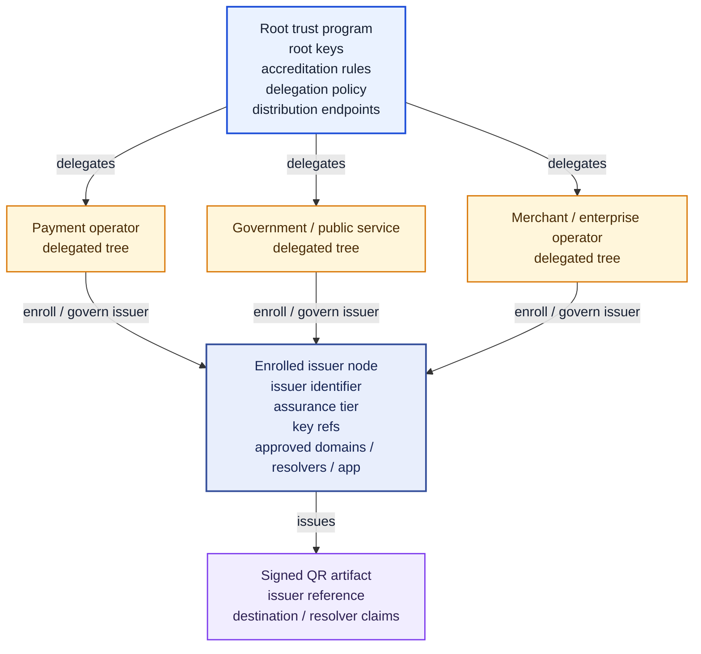
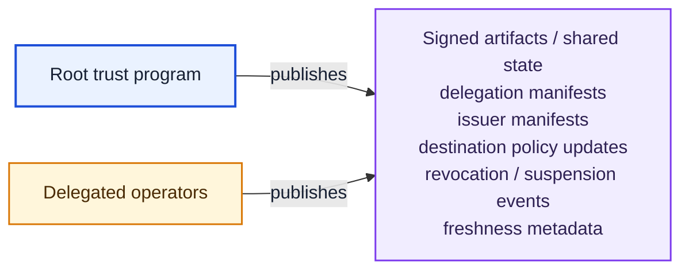
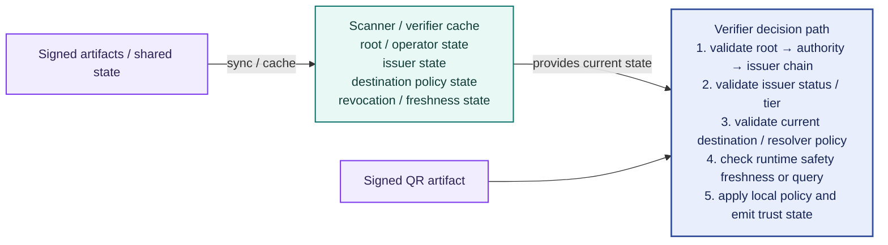

# QR Trust Authority Flow

Date: 2026-08-21

Purpose:
- render the paper's Figure 2 as a diagram the docs site can display and zoom
- separate governance (who may delegate to whom) from validation (what a
  verifier does at scan time)

Source figure:
- `Figure 2` in the [published QR trust paper](https://papers.ssrn.com/sol3/papers.cfm?abstract_id=6577478)
- published visual asset: [QR_TRUST_AUTHORITY_FLOW.svg](./QR_TRUST_AUTHORITY_FLOW.svg)
- semantic reference: [QR_TRUST_AUTHORITY_FLOW_ASCII.md](./QR_TRUST_AUTHORITY_FLOW_ASCII.md)

The SVG remains the authoritative published artwork. The diagrams below restate
the same governance semantics in the docs' own diagram style; if the two ever
diverge, the paper's figure governs.

!!! note "Diagram color key"
    Color encodes function, not trustworthiness: blue marks the root of the
    trust program, amber marks delegated governance, violet marks issued and
    published artifacts, and green marks the verifier side that consumes them.
    Select any diagram to open the interactive zoom-and-pan view.

## Governance and Delegation

Delegation is the only path to issuing authority: an issuer node exists because
an operator enrolled it under rules the root program set, and the signed
artifact carries a reference back up that chain rather than standing on its own.

## Shared State Publication

Both tiers publish into the same shared state. Revocation and freshness travel
this path, which is what lets a verifier reach a different decision tomorrow
about an artifact that has not changed.

## State Synchronization and Validation

The decision path takes two inputs, not one: the scanned artifact and the cached
current state. That second input is the whole point of the figure — a verifier
that only reads the artifact can validate a signature but cannot answer whether
the destination is still approved or whether the issuer is still in good
standing.
