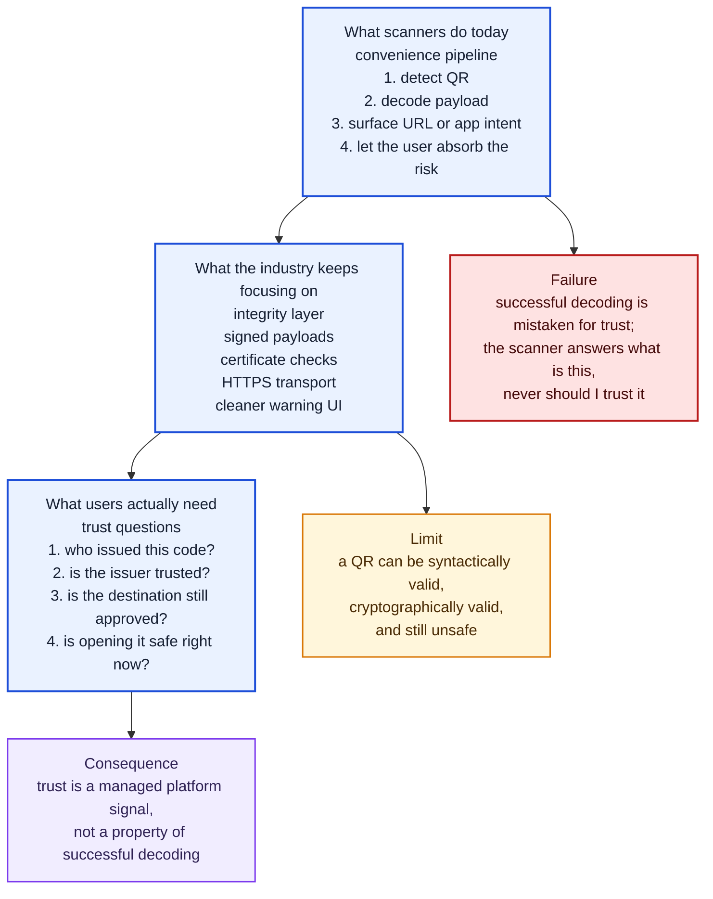
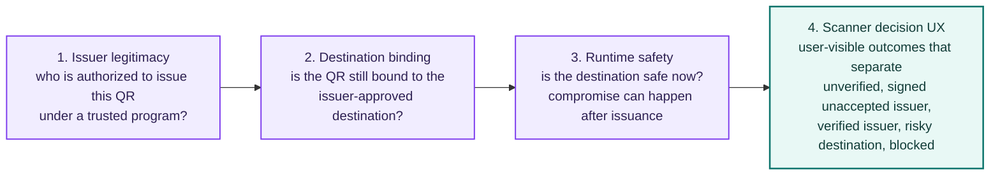

# QR Trust Problem Diagram

Date: 2026-08-21

Purpose:
- render the paper's Figure 1 as a diagram the docs site can display and zoom
- show why successful decoding is not the same thing as trust

Source figure:
- `Figure 1` in the [published QR trust paper](https://papers.ssrn.com/sol3/papers.cfm?abstract_id=6577478)
- published visual asset: [QR_TRUST_PROBLEM_DIAGRAM.svg](./QR_TRUST_PROBLEM_DIAGRAM.svg)
- semantic reference: [QR_TRUST_PROBLEM_DIAGRAM_ASCII.md](./QR_TRUST_PROBLEM_DIAGRAM_ASCII.md)

The SVG remains the authoritative published artwork. The diagrams below restate
the same relationships in the docs' own diagram style; if the two ever diverge,
the paper's figure governs.

!!! note "Diagram color key"
    Color encodes function, not trustworthiness: blue marks the framing columns,
    red marks the failure this figure is about, amber marks a limit of the
    current approach, violet marks the architectural conclusion, and green marks
    the decision layer the trust stack builds toward. Select any diagram to open
    the interactive zoom-and-pan view.

## Why Decoding Is Mistaken for Trust

The three columns read left to right as an escalation: what scanners ship, what
the industry has invested in, and what a user is actually trying to find out.
Each column drops to the problem it leaves unsolved.

## Required Trust Stack

Issuer legitimacy
:   Examples of what a trusted program accredits: verified individual, verified
    business, verified institution, payment operator.

Destination binding
:   Checks: exact URL, normalization, subdomain policy, post-issuance changes.

Runtime safety
:   Inputs: redirects, reputation, malware, phishing, injected content.

Scanner decision UX
:   The five outcomes above are specified in
    [SCANNER_UX_STATES.md](./SCANNER_UX_STATES.md) and mapped to policy in
    [SCANNER_DECISION_MATRIX.md](./SCANNER_DECISION_MATRIX.md).
