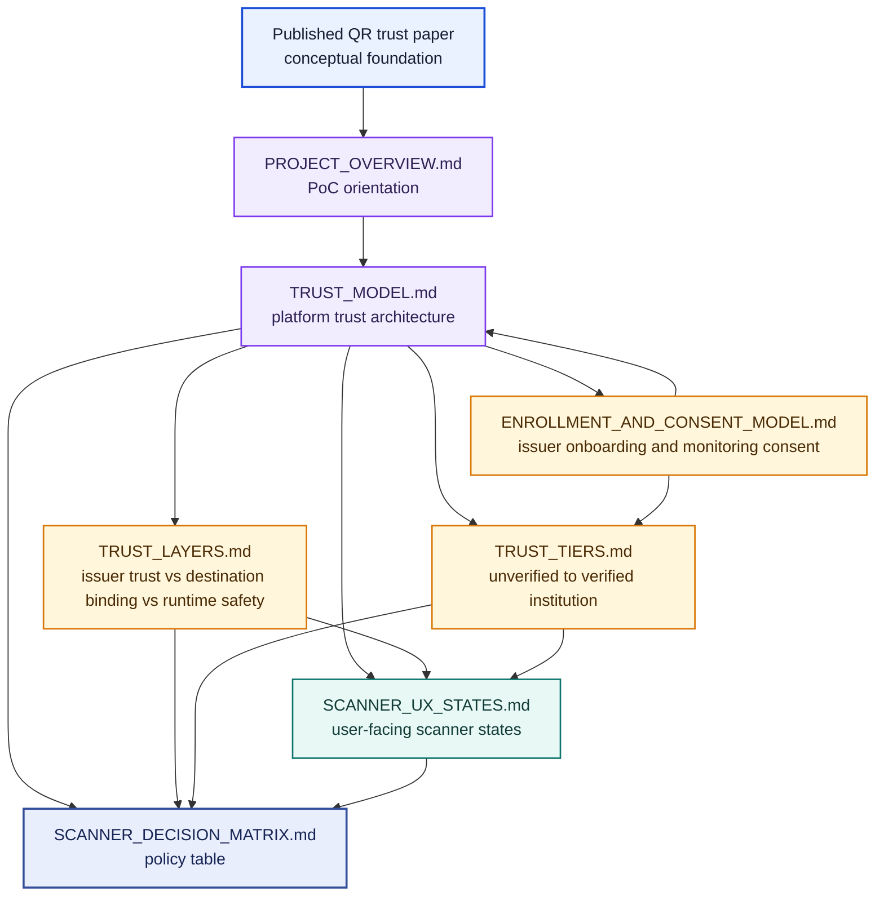
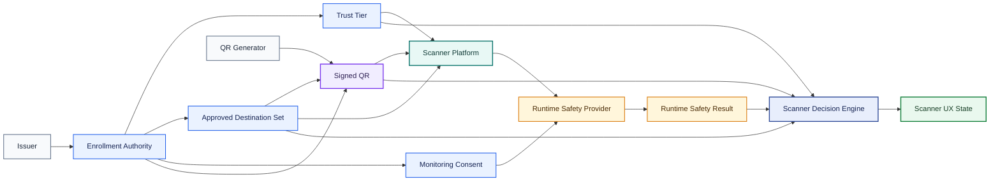
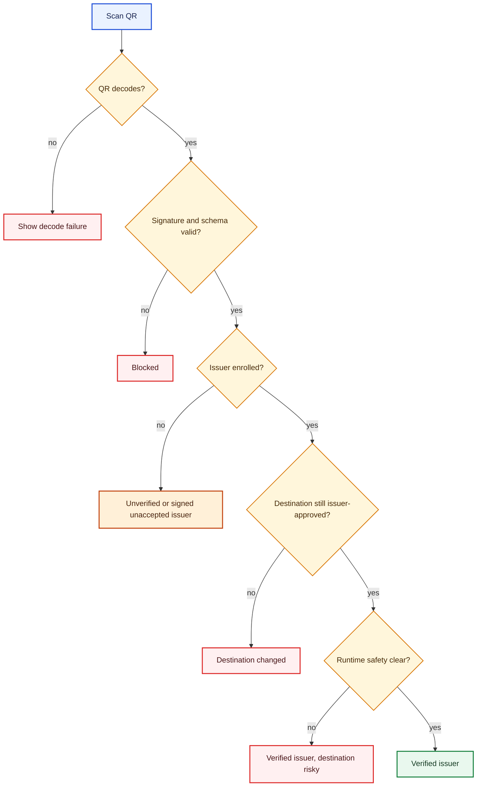

# Trust Model Graph

Date: 2026-04-12

Purpose:
- show how the trust-model documents relate to each other
- make it easier to move from research to architecture to scanner behavior

!!! note "Diagram color key"
    Color encodes function, not trustworthiness: blue marks foundations and
    inputs, violet marks architecture and scanner components, amber marks
    policy or decision points, red marks blocking outcomes, and green marks a
    positive verified outcome. Select any diagram to open the interactive
    zoom-and-pan view.

## Document Dependency Graph

## System Relationship Graph

## Scanner Decision Flow

## How To Read This Set

1. Start with the [published paper](./CITING.md) and
   [project overview](./PROJECT_OVERVIEW.md). These separate the conceptual
   argument from what the current PoC implements and evaluates.

2. Move to [TRUST_MODEL.md](./TRUST_MODEL.md).
   This is the top-level architecture.

3. Use the specialized documents to pressure-test the model:
   - [TRUST_LAYERS.md](./TRUST_LAYERS.md)
   - [TRUST_TIERS.md](./TRUST_TIERS.md)
   - [ENROLLMENT_AND_CONSENT_MODEL.md](./ENROLLMENT_AND_CONSENT_MODEL.md)
   - [SCANNER_UX_STATES.md](./SCANNER_UX_STATES.md)
   - [SCANNER_DECISION_MATRIX.md](./SCANNER_DECISION_MATRIX.md)

## Current Gap

The main unresolved design question across all these documents is:

- who operates the enrollment authority and trust-root program for ordinary consumer QR destinations?

That is the strongest unresolved dependency in the whole model.
